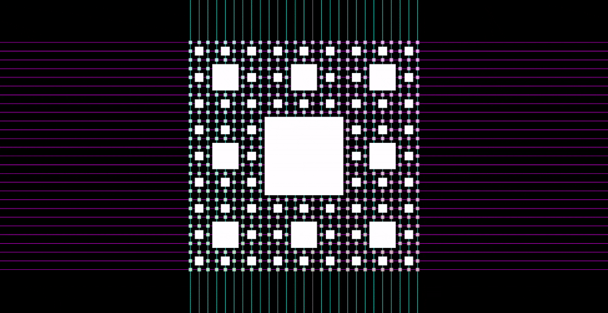
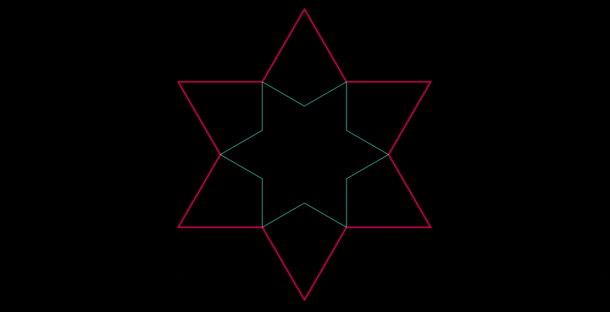

# Fractal Shaders with Rust-GPU

A project for rendering fractal shapes using shaders written entirely in Rust via [Rust-GPU](https://github.com/Rust-GPU/rust-gpu).

## Overview

This project uses:
- **Rust-GPU** - Write GPU shaders in Rust, compiled to SPIR-V
- **wgpu** - Cross-platform graphics API for rendering
- **winit** - Window creation and event handling


## Prerequisites

- Rust (Edition 2024)
- Vulkan-compatible GPU and drivers

## How to Build & Run

```bash
# Build the shaders (compiles Rust to SPIR-V)
cargo gpu build

# Run the application
cargo run -p mygraphics

# Select a shader to run:

#   1. Sierpinski Triangle
#   2. Sierpinski Carpet
#   3. Koch Curve
#   4. Mandelbrot Set
#   5. Julia Set
#   6. Sierpinski Tetrahedron
#   7. Menger Sponge
#   8. Mandelbulb
#   9. Mandelbox

# Enter your choice (1-9):
```

## Fractals

### 2D Fractals

| Fractal | Hausdorff Dimension | Status |
|---------|---------------------|--------|
| Sierpinski Triangle | $D = \log_{2}{3} \approx 1.585$ | Done |
| Sierpinski Carpet | $D = \log_{3}{8} \approx 1.893$ | Done |
| Koch Curve | $D = \log_{3}{4} \approx 1.262$ | Done |
| Mandelbrot Set | $D = 2$ | Done |
| Julia Set | $D = 2$ | Done |

---

#### Sierpinski Triangle


The **Sierpinski Triangle** (also called Sierpinski Gasket) is a self-similar fractal created by recursively removing the central inverted triangle from an equilateral triangle.

**Construction:** Start with an equilateral triangle. Connect the midpoints of the three sides to form four smaller triangles. Remove the central triangle. Repeat for each remaining triangle.

**Formula:** A point $(x, y)$ belongs to the Sierpinski Triangle if, when converted to barycentric coordinates, the following condition holds recursively:

$$
\text{Inside if } \lfloor 2x \rfloor + \lfloor 2y \rfloor < 2 \text{ (for normalized coordinates)}
$$

Using space-folding technique:
$$
p = |p| \quad \text{(fold to positive quadrant)}
$$
$$
p = p - \frac{1}{2}(p \cdot n)n \quad \text{(fold across edge normals)}
$$

---

#### Sierpinski Carpet



The **Sierpinski Carpet** is a plane fractal that generalizes the Cantor set to two dimensions. It is created by recursively subdividing a square into 9 smaller squares and removing the central one.

**Construction:** Divide the square into a 3×3 grid. Remove the center square. Repeat for each of the 8 remaining squares.

**Formula:** A point $(x, y) \in [0,1]^2$ is in the carpet if no digit in the base-3 representation of both $x$ and $y$ is simultaneously 1:

$$
\text{Not in carpet if } \exists k: \lfloor 3^k x \rfloor \mod 3 = 1 \land \lfloor 3^k y \rfloor \mod 3 = 1
$$

**Iteration formula:**
$$
p = 3p - \lfloor 3p + 0.5 \rfloor \quad \text{(scale and center)}
$$

---

#### Koch Curve



The **Koch Curve** (Koch Snowflake when closed) is a fractal curve created by repeatedly replacing each line segment with a bent line consisting of four segments of equal length.

**Construction:** Start with a line segment. Divide into three equal parts. Replace the middle third with two sides of an equilateral triangle (removing the base). Repeat for all segments.

**Recursive definition:** If $K_0$ is a line segment, then:
$$
K_{n+1} = \text{Transform}(K_n) \text{ where each segment becomes 4 segments of length } \frac{1}{3}
$$

**Parametric formula** for iteration $n$:
$$
\text{Length} = \left(\frac{4}{3}\right)^n \cdot L_0
$$

**Angle at each bend:** $60°$ or $\frac{\pi}{3}$ radians

---

#### Mandelbrot Set


The **Mandelbrot Set** is the set of complex numbers $c$ for which the iterated function does not diverge to infinity when starting from $z = 0$.

**Iteration formula:**
$$
z_{n+1} = z_n^2 + c
$$

where $z_0 = 0$ and $c$ is the point being tested.

**Escape condition:** A point $c$ is considered outside the set if:
$$
|z_n| > 2 \text{ (escape radius)}
$$

**Complex arithmetic:**
$$
z = x + iy
$$
$$
z^2 = (x^2 - y^2) + i(2xy)
$$

**Coloring:** Based on escape iteration count $n$ with smooth coloring:
$$
\text{smooth } n = n + 1 - \frac{\log(\log|z_n|)}{\log 2}
$$

---

#### Julia Set


The **Julia Set** is closely related to the Mandelbrot Set. For a fixed complex constant $c$, the Julia Set is the boundary of points that do not escape to infinity under iteration.

**Iteration formula:**
$$
z_{n+1} = z_n^2 + c
$$

where $z_0$ is the point being tested and $c$ is a fixed constant.

**Key difference from Mandelbrot:**
- Mandelbrot: $z_0 = 0$, $c$ varies per pixel
- Julia: $c$ is fixed, $z_0$ varies per pixel

**Common Julia constants:**
- $c = -0.7 + 0.27015i$ (spiral pattern)
- $c = -0.8 + 0.156i$ (dendrite)
- $c = -0.4 + 0.6i$ (rabbit)

**Escape condition:**
$$
|z_n|^2 > 4
$$

---

### 3D Fractals (Ray Marching)

| Fractal | Hausdorff Dimension | Status |
|---------|---------------------|--------|
| Sierpinski Tetrahedron | $D = 2$ | Done |
| Menger Sponge | $D = \log_{3}{20} \approx 2.727$ | Done |
| Mandelbulb | $D = 3$ (conjectured) | Done |
| Mandelbox | Varies | Done |

All 3D fractals use **ray marching** with signed distance functions (SDF):

$$
\text{position} = \text{origin} + t \cdot \text{direction}
$$
$$
t_{n+1} = t_n + \text{SDF}(\text{position}_n)
$$

---

#### Sierpinski Tetrahedron


The **Sierpinski Tetrahedron** (Tetrix) is the 3D analog of the Sierpinski Triangle. It is constructed by recursively removing the central octahedron from a tetrahedron.

**Construction:** Start with a regular tetrahedron. Connect the midpoints of all edges to form 4 smaller tetrahedra at the corners. Remove the central octahedron. Repeat.

**Space folding SDF:**
$$
p = |p| \quad \text{(absolute value fold)}
$$

**Vertex fold:** Fold space across planes passing through edges toward vertices:
$$
p = p - 2 \cdot \min(0, p \cdot n) \cdot n
$$

where $n$ is the normal to each folding plane.

**Scale and translate:**
$$
p = 2p - \text{offset}
$$

**Distance estimate:**
$$
d = \frac{|p| - r}{\text{scale}^n}
$$

---

#### Menger Sponge


The **Menger Sponge** is a 3D fractal that generalizes the Sierpinski Carpet to three dimensions. It is created by recursively removing cross-shaped sections from a cube.

**Construction:** Divide the cube into a 3×3×3 grid (27 smaller cubes). Remove the center cube and the 6 cubes sharing a face with it (7 cubes total, leaving 20). Repeat for each remaining cube.

**Volume after $n$ iterations:**
$$
V_n = \left(\frac{20}{27}\right)^n \cdot V_0
$$

**SDF using space folding:**
$$
p = |p| \quad \text{(fold to positive octant)}
$$
$$
\text{if } p.x < p.y: \text{swap}(p.x, p.y)
$$
$$
\text{if } p.x < p.z: \text{swap}(p.x, p.z)
$$
$$
\text{if } p.y < p.z: \text{swap}(p.y, p.z)
$$

**Scale and offset:**
$$
p = 3p - 2 \cdot \text{offset}
$$

**Cross removal condition:**
$$
\text{if } p.z > 1: p.z = p.z - 2
$$

---

#### Mandelbulb


The **Mandelbulb** is a 3D analog of the Mandelbrot Set, using spherical coordinates to define a power operation in 3D space.

**Spherical coordinates:**
$$
r = |z| = \sqrt{x^2 + y^2 + z^2}
$$
$$
\theta = \arctan\left(\frac{\sqrt{x^2 + y^2}}{z}\right) = \arccos\left(\frac{z}{r}\right)
$$
$$
\phi = \arctan\left(\frac{y}{x}\right)
$$

**Power formula (for power $n$, typically $n=8$):**
$$
z^n = r^n \begin{pmatrix} \sin(n\theta)\cos(n\phi) \\ \sin(n\theta)\sin(n\phi) \\ \cos(n\theta) \end{pmatrix}
$$

**Iteration:**
$$
z_{k+1} = z_k^n + c
$$

where $c$ is the initial point and $z_0 = c$.

**Distance estimate:**
$$
\text{DE} = 0.5 \cdot \frac{\ln(r) \cdot r}{|dz|}
$$

where $|dz|$ is the running derivative.

**Escape condition:**
$$
r > 2 \text{ (bailout radius)}
$$

---

#### Mandelbox


The **Mandelbox** is a box-like fractal discovered by Tom Lowe in 2010. It uses conditional folding operations rather than power formulas.

**Box fold:** Fold each component into the range $[-1, 1]$:
$$
x = \begin{cases}
-2 - x & \text{if } x < -1 \\
x & \text{if } -1 \leq x \leq 1 \\
2 - x & \text{if } x > 1
\end{cases}
$$

**Ball fold:** Apply spherical inversion based on distance from origin:
$$
z = \begin{cases}
z / r_{\min}^2 & \text{if } |z| < r_{\min} \\
z / |z|^2 & \text{if } r_{\min} \leq |z| < 1 \\
z & \text{if } |z| \geq 1
\end{cases}
$$

where $r_{\min} = 0.5$ (typical value).

**Full iteration:**
$$
z_{n+1} = s \cdot \text{ballFold}(\text{boxFold}(z_n)) + c
$$

where $s$ is the scale factor (typically $s = 2$) and $c$ is the initial point.

**Distance estimate:**
$$
\text{DE} = \frac{|z| - r_{\min}}{|dz|}
$$

---

## Credit
- [pedrotrschneider](https://github.com/pedrotrschneider/shader-fractals) has written fractal shaders in glsl
## Resources

- [Rust-GPU](https://github.com/Rust-GPU/rust-gpu) - Compile Rust to SPIR-V
- [wgpu](https://wgpu.rs/) - Safe Rust graphics API


## License

MIT